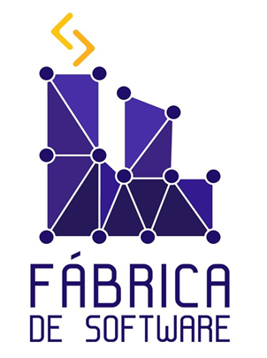

    </img>

    <h1 text-align='center'>Ciência de Dados - 2025.02 📈</h1>

    
Repositório utilizada para ministrar uma aula introdutório sobre Machine Learning no Workshop de Dados.

---

### 📖 Materiais da Aula:

1. Exercício; <a href="https://github.com/Marceloalen07/Machine_Learning_python/blob/master/exercicio/Exércicio.md">Clique aqui</a>

2. Slides; <a href="https://gamma.app/docs/Machine-Learning-em-Python-wpnt6o28v20hyli?mode=doc">Clique aqui</a>

---

### 📚 Materiais para Estudo:

Curso na Udemy **(Pago)** - Machine Learning e Data Science com Python de A a Z: <a href="https://www.udemy.com/share/101sO83@CTwZ7GsupE_giZm8Pgz09GiOMSnD2ksySY82p_5Sw73L0yjHA4Wl72NTe2a8UTKdkg==/">Clique aqui</a>

Curso na Udemy **(Pago)** - Formação Cientista de Dados: O Curso Completo - 2025: <a href="https://www.udemy.com/share/101Xys3@kjSBdYF7XO1U5XLGXG7vf2D9bEcbyxBNCY6KLikwD8wX7vXLOMU6M9SkqhTOhu5jiA==/">Clique aqui</a>

Bootcamp na DIO **(Gratuito)** - Santander 2025 - Ciência de Dados com Python: <a href="https://app.santanderopenacademy.com/en/program/santander-bootcamp-2025-2-sem?utm_source=DIO&utm_medium=Enroll&utm_campaign=SOABR-santander-bootcamp-2025-2-sem">Clique aqui</a>

Data Science Academy **(Gratuito)** - Cursos Gratuitos : <a href="https://www.datascienceacademy.com.br/cursosgratuitos?msg=not-logged-in">Clique aqui</a>

---

### 🔎 Possíveis Soluções para o Desafio Final

1. Banco Box; <a href="https://github.com/Marceloalen07/Machine_Learning_python/blob/master/desafio%20final/banco_box.ipynb">Clique aqui</a>

2. Academia RedFit; <a href="https://github.com/Marceloalen07/Machine_Learning_python/blob/master/desafio%20final/academia_redfit.ipynb">Clique aqui</a>

3. Prever Câncer de Pulmão; <a href="https://github.com/Marceloalen07/Machine_Learning_python/blob/master/desafio%20final/pneumologista.ipynb">Clique aqui</a>